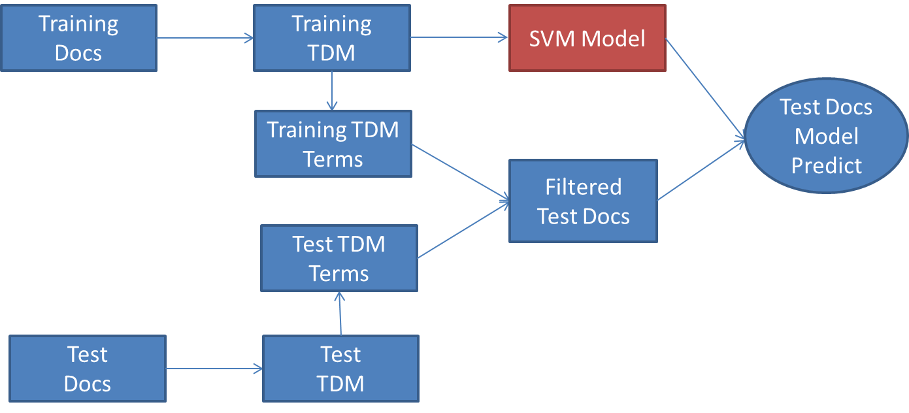

### What is it?

-----------      

It's an example of classify natural language documents using Single-node RSpark. The long-term target of the project is to build a model that is able to classify big data scale documents with high accuracy. High accuracy may require multi-classifier and multi-training-source model and big data scale processing needs Spark architect. 

In summary, the project contains four tasks:

- Spark architect 
- Training sources library
- Classifier library
- Model 

### File Description

------------       

- `training_source.R`

Library of training sources, in other words, Library of the documents with lables. Each training source store in one seperate file in folder training_source.  

- `classifiers.R`

Library of classifiers. The modelling process follows "RTextTools"  

- `spark_init.R`

libaray of functions of spark core initilizing or convert different text format files into RDD

- `ISR_SVM_SparkR_Classification.R`

core function of SVM classifier using ISR as training set. 

